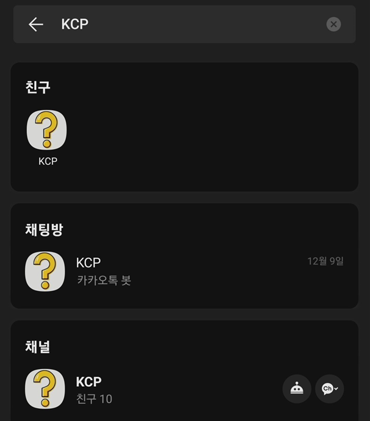
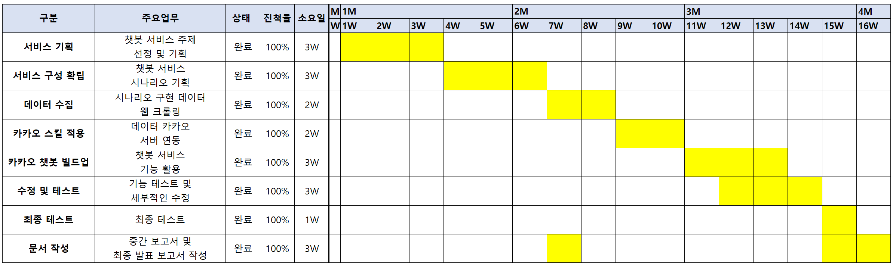
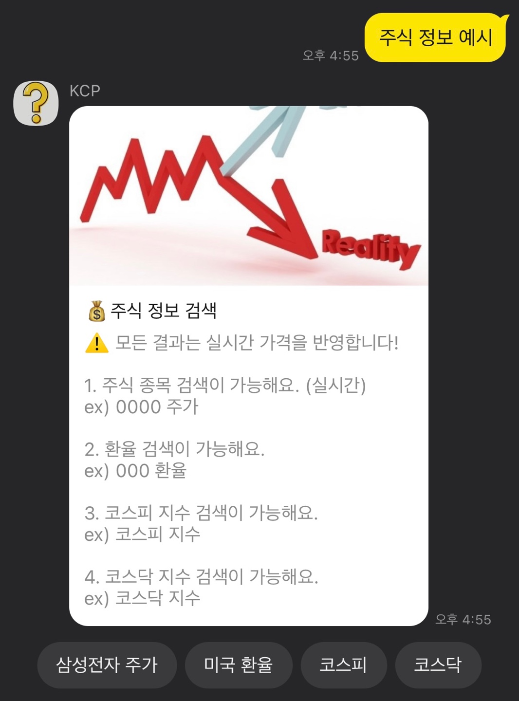
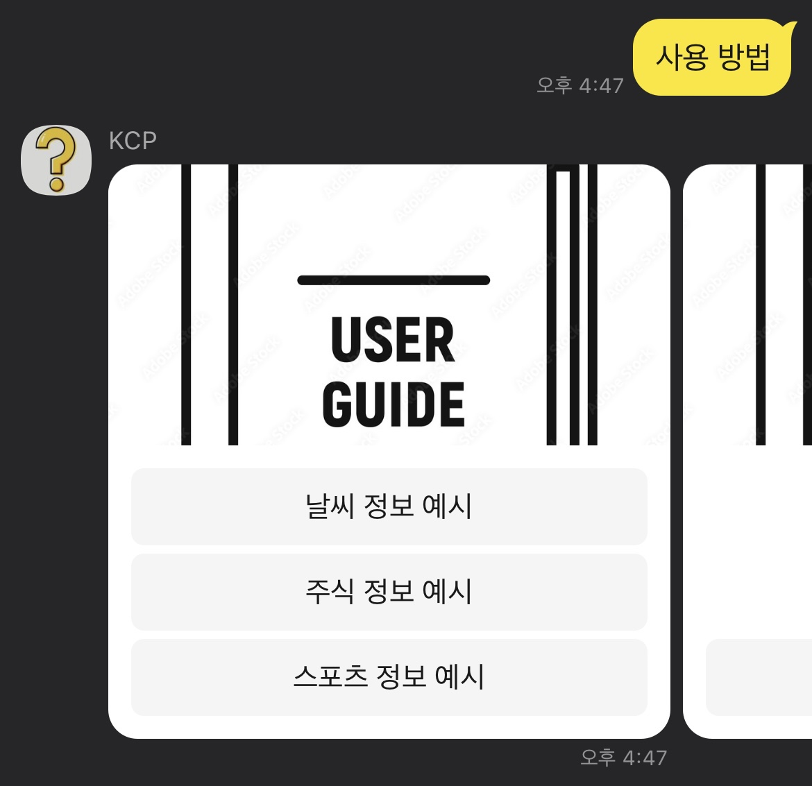
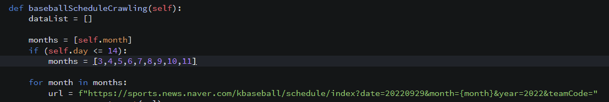
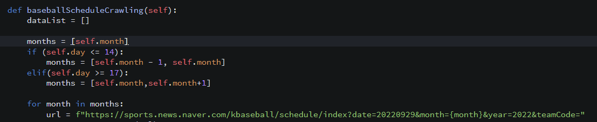

 

# 💬 Kakao Chatbot Project (KCP) 

> 본 프로젝트는 카카오톡 기반 챗봇을 구현하여  
> **날씨, 주식, 스포츠 정보를 실시간으로 제공**하는 것을 목표로 합니다.  
> Python과 BeautifulSoup을 활용하여 웹 데이터를 수집하고,  
> 카카오 비즈니스 API와 GoormIDE 환경에서 서버를 연동하였습니다.

 

## 📖 프로젝트 개요
- **주제 선정 이유**: 실시간으로 변화하는 정보를 사용자가 직접 검색하지 않고,  
  카카오톡 챗봇을 통해 간편하게 제공받을 수 있도록 하기 위함  
- **목표**: 카카오 챗봇을 통한 사용자 맞춤형 정보 제공 (날씨, 주식, 스포츠)  
- **환경**: Python, Goorm IDE, kakao open builder, BeautifulSoup  

 

## 👥 팀 구성 및 역할
- **최지혁**: 주식 정보검색 구현, 서버 구축 및 연동
- **김재엽**: 기획, 날씨 정보검색 구현, PPT 제작 
- **박민우**: 스포츠 정보검색 구현, 시나리오 기획  

 

## 📅 개발 일정

 

  

 

## 🛠️주요 기능
- **스포츠**: 경기 결과, 리그 순위, 일정, 팀 데이터 조회
- **주식**: 국내 지수, 기업 주가, 환율 정보 조회
- **날씨**: 최근/주간 날씨, 지역별 오늘·내일·모레 날씨 정보 

  

 

## 🔧 상세 기능 요구사항
- **시나리오 기반 처리**: 사용자가 특정 키워드를 입력하면 파라미터 매칭 → 서버 호출 → 데이터 크롤링 → 응답 반환  
- **예외 처리**: 잘못된 입력 시 사용방법 안내  
- **사용자 인터페이스**: 카카오 플러스 친구 등록 후 챗봇 대화창 이용  

  

 

 

## 🔍 문제 해결
- **문제**: BeautifulSoup 크롤링 시 응답 지연(5초 초과) 발생  
- **해결방안**: 불필요한 모든 달 검색 → 최소 필요한 달만 검색하도록 코드 수정  

 

 문제 해결 전

  

 

 문제 해결

  

 

## ⚙️ 사용 기술
- **언어**: Python  
- **데이터 수집**: BeautifulSoup4 (웹 크롤링)  
- **플랫폼**: Kakao Biz API, Goorm IDE  
- **프레임워크**: Flask  
- **문서화**: PPT, HWP 

 

## 📎 참고 자료
해당 README는 요약본이며, 자세한 설계 문서 및 이미지 자료는 아래 첨부 문서에서 확인 가능합니다.

- 📄 [Kakao_Chatbot_Project_Report.pdf](./Kakao_Chatbot_Project_Report.pdf)
